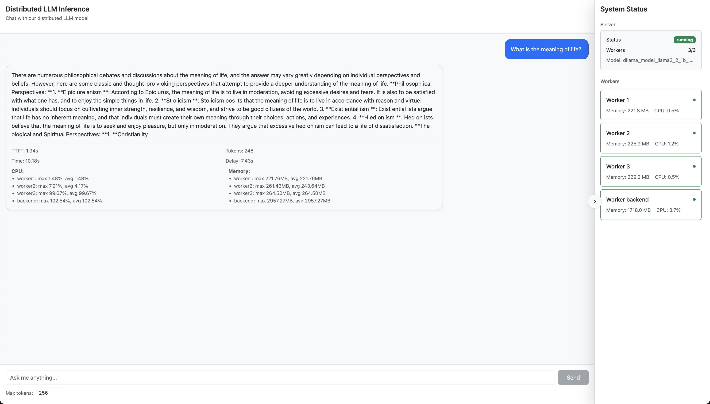
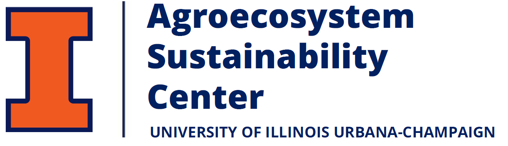
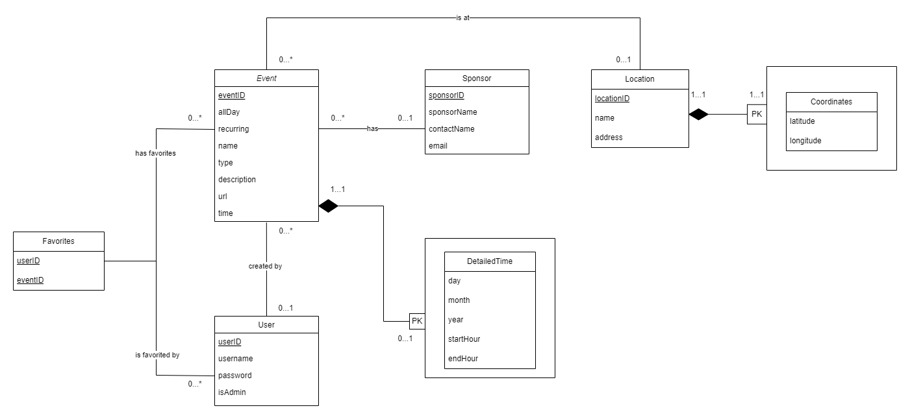
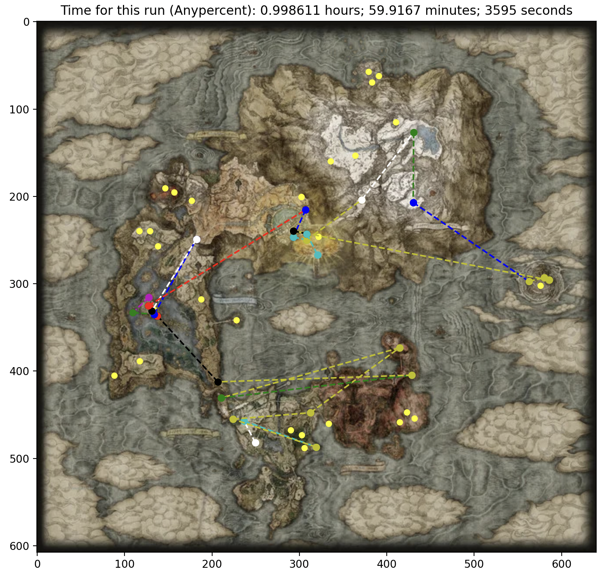
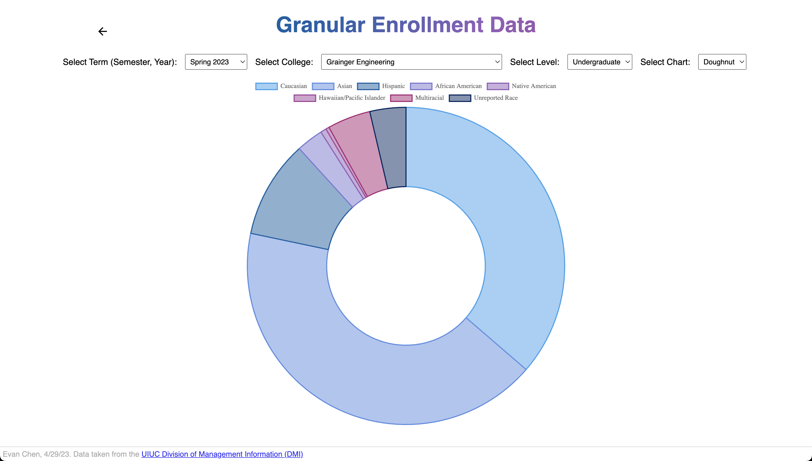

<meta name="description" content="Discover the projects of Evan Zuyou Chen, showcasing expertise in Full Stack Development, Cloud Computing, and Data Engineering.">
<meta name="keywords" content="Evan Chen, Evan Zuyou Chen, Evan Chen UIUC, Evan Chen Software, Software Engineer, Full Stack Developer, Computer Science, University of Illinois, UIUC, Cloud Computing, Data Engineering, Agricultural Technology">

  

    <article class="archive__item">
      

        
      

      

        <h2 class="project-title">
          Simulating Edge Device Inference
          Mar. 2025 — May 2025
        </h2>
        

          LLMs
          Containerization
          Docker
        

        

          Course project for CS598: Systems for GenAI. Collaborated with four other graduate students to develop a containerized LLM model sharding system that simulates inference across virtual edge devices, enabling practical latency and efficiency tests on a single device with configurable constraints. 
        

          <a href="https://drive.google.com/file/d/1UctPPUURX3qTpCzxAdKUNoD8dMVvrx1X/view?usp=sharing" target="_blank" rel="noopener noreferrer" style="margin-top: 0.2em">[Paper]</a>
          <a href="https://github.com/CourTeous33/docker-distributed-llm" target="_blank" rel="noopener noreferrer">[Code]</a>
      

    </article>
  

  

    <article class="archive__item">
     

        
      

      

        <h2 class="project-title">
          ASC Website Development
          Jan. 2024 — May 2024
        </h2>
        

          PHP
          WordPress
        

        

          Maintained the UIUC Agroecosystem Sustainability Center (ASC) website through PHP template modifications and custom WordPress blocks. Changes support categorized news posts, MailChimp integration for newsletters, and ease of future updates through advanced custom fields and plugins. 
        

         <a href="https://asc.illinois.edu/" target="_blank" rel="noopener noreferrer" style="margin-top: 0.2em">[Website]</a>
      

    </article>
  

  

    <article class="archive__item">
      

        
      

      

        <h2 class="project-title">
          IlliniMap
          Oct. 2023 — Dec. 2023
        </h2>
        

          MySQL
          Python
          Express.js
        

        

          Course project for CS411: Database Systems. Collaborated with three other students to develop a full-stack web application allowing users to view general events at UIUC overlaid on an interactive map. Utilized Python to scrape calendar data and designed a MySQL DB to store events, users, and locations. 
        

      

    </article>
  

  

    <article class="archive__item">
      <!-- 

        
      
 -->
      

        <h2 class="project-title">
          Multimodal Machine Learning
          Jun. 2023
        </h2>
        

          PyTorch
          AWS SageMaker
          Tensorboard
        

        

          Collaborated with two other engineers in State Farm’s annual internal Hackathon to create a predictive machine learning model in PyTorch combining tabular and image data to predict housing price. Achieved a 65% improvement in RMSE relative to price prediction over tabular-only or image-only models trained on the same dataset.
        
 
      

    </article>
  

  

    <article class="archive__item">
      

        
      

      

        <h2 class="project-title">
          Elden Ring Speedrun Optimizer
          Apr. 2023 — May 2023
        </h2>
        

          C++
          Graph Algorithms
          Python
        

        

          Course project for CS225: Data Structures & Algorithms. Collaborated with four other students to implement a graph algorithm (Dijkstra's, Floyd-Warshall) approach to finding optimal speedrunning routes for video game Elden Ring. Representing bosses as nodes and time as weight with logic for pre-requisite nodes, predicted times within 5% of real world records. Visualized with Python.
        
 
        <a href="https://github.com/zuyouchen/225-final-proj" target="_blank" rel="noopener noreferrer">[Code]</a>
      

    </article>
  

  

    <article class="archive__item">
      

        
      

      

        <h2 class="project-title">
          UIUC Enrollment Data Visualization
          Apr. 2023
        </h2>
        

          Python
          Chart.js
          Data Visualization
        

        

          Course project for IS308: Race, Gender, and Information Technology. Developed an interactive website to visualize both granular (semester-specific) and cumulative (time-series) university enrollment data by race. Used Python to process 50+ CSV files containing 18 years of enrollment data sourced from the UIUC Division of Management Information (DMI).
        
 
        <a href="https://zuyouchen.github.io/is308-final-proj/" target="_blank" rel="noopener noreferrer" style="margin-top: 0.2em">[Website]</a>
        <a href="https://github.com/zuyouchen/is308-final-proj" target="_blank" rel="noopener noreferrer">[Code]</a>
      

    </article>
  

<!-- Sample Format (Copy, Paste, Uncomment, and Customize) -->

<!-- 

  <article class="archive__item">
    

      
    

    

      <h2 class="project-title">
        Project Name
        (Start Date — End Date)
      </h2>
      

        Skill 1
        Skill 2
        Skill 3
      

      

        Project description highlighting objectives, methodologies, and outcomes.
      

    

  </article>

 -->