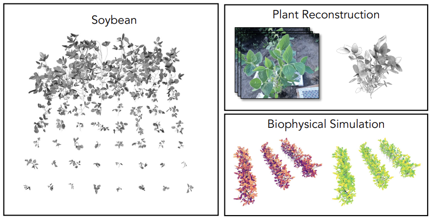

<meta name="description" content="Explore the publications of Evan Zuyou Chen, a Software Engineer and M.S. Computer Science student at UIUC, specializing in Full Stack Development, Cloud Computing, and Data Engineering.">
<meta name="keywords" content="Evan Chen, Evan Zuyou Chen, Evan Chen UIUC, Evan Chen Software, Software Engineer, Full Stack Developer, Computer Science, University of Illinois, UIUC, Cloud Computing, Data Engineering, Agricultural Technology">

   Publication #1 
  

    <article class="archive__item">
      

        
      

      

        <h2 class="archive__item-title">Demeter: A Parametric Model of Crop Plant Morphology from the Real World</h2>
        

            <a href="https://tianhang-cheng.github.io/" target="_blank" rel="noopener noreferrer">Tianhang Cheng</a>, <a href="https://ajzhai.github.io/" target="_blank" rel="noopener noreferrer">Albert Zhai</a>, <b>Evan Chen</b>, and 
            
              13 more authors
              
                Rui Zhou, Yawen Deng, Zitong Li, Kejie Zhao, Janice Shiu,
                Qianyu Zhao, Yide Xu, Xinlei Wang, Yuan Shen, Sheng Wang, Lisa Ainsworth, Kaiyu Guan, Shenlong Wang
                [less]
              
           
          <i>International Conference on Computer Vision (ICCV) 2025</i> 
          <a href="https://arxiv.org/abs/2510.16377" target="_blank" rel="noopener noreferrer">[Paper]</a>
          <a href="https://tianhang-cheng.github.io/Demeter/" target="_blank" rel="noopener noreferrer">[Website]</a>
          <!-- <a href="https://iccv.thecvf.com/virtual/2025/poster/2558" target="_blank" rel="noopener noreferrer">[Poster]</a> -->
        

      

    </article>
  



  

    <article class="archive__item">
      

        
      

      

        <h2 class="archive__item-title">Demeter: A Parametric Model of Crop Plant Morphology from the Real World</h2>
        

          Tianhang Cheng, Albert J. Zhai, <b>Evan Z. Chen</b>, and 

            
13 more authors

            Rui Zhou, Yawen Deng, Zitong Li, Kejie Zhao, Janice Shiu,
            Qianyu Zhao, Yide Xu, Xinlei Wang, Yuan Shen, Sheng Wang, Lisa Ainsworth, Kaiyu Guan, Shenlong Wang
          
 
          <i>Conference on Important Things 2023</i> 
          <a href="#">[Paper]</a> <a href="#">[Poster]</a>
        

      

    </article>
  



